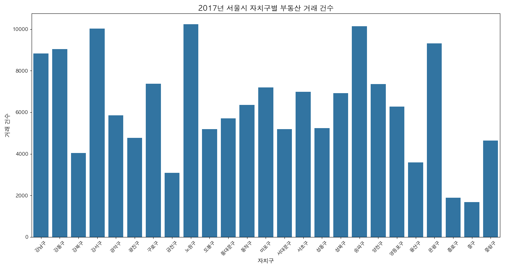

# AI-X
# 서울시 부동산 실거래가 정보를 활용한 26년도 집값 예측
<br>

발표 동영상 링크
https://
<br>
<br>

## 목차
1. [Members](#members)
2. [Proposal](#i-proposal)
3. [Datasets](#ii-datasets)
4. [Methodology](#iii-methodology)
5. [Evaluation & Analysis](#iv-evaluation--analysis)
6. [Related Work](#v-related-work)
7. [Conclusion](#vi-conclusion-discussion)
8. [Credits](#vii-credits)
<br>
<br>


## Members
- 최가형 | kahyung.choi@lge.com
- 유준석 | alex.you@lge.com
- 심규호 | yuho.shim@lge.com
<br>
<br>


## I. Proposal
### Motivation
집값의 변동을 알아보고 향후 집값이 상승할지 예측하기 위해
<br>


### Goal
이 프로젝트의 목표는 특정 지역의 집값 상승/하강을 예측하기 위해 관련 변수의 상관성을 분석하는 것
<br>


### 서울시 집 값
<br>
<br>


## II. Datasets
### Datasets
* 데이터셋 링크
```
서울 열린데이터 광장 : [https://data.seoul.go.kr]
서울 열린데이터 광장 공공데이터 : https://data.seoul.go.kr/dataList/datasetList.do
서울시 부동산 실거래가 정보 : 2017년도 부터 2025년도 정보 활용 (코로나 이전 시기 데이터 포함)
```
<br>

#### 1. 환경 설정
```bash
# 가상환경 생성 및 활성화
python -m venv venv
source venv/bin/activate  # Linux/Mac
# 또는
.\venv\Scripts\activate  # Windows

# 필요한 패키지 설치
pip install pandas
pip install matplotlib
pip install seaborn
```

#### 2. 데이터 준비
- `datasets` 디렉토리에 CSV 파일을 위치시킵니다.
- 파일명 형식: `서울시 부동산 실거래가 정보_YYYY.csv`

#### 3. 스크립트 실행
```bash
python read_csv.py
```
#### 4. 실행 결과 예시 (아래와 같이 결측치가 없는지를 확인한다.)
스크립트 실행 후 다음과 같은 결과를 확인할 수 있습니다:

```
=== 정제 후 데이터 분석 ===

=== 결측치 분석 ===

각 컬럼별 결측치 개수:
접수연도        0
자치구코드       0
자치구명        0
법정동코드       0
법정동명        0
지번구분        0
지번구분명       0
본번          0
부번          0
건물명         0
계약일         0
물건금액(만원)    0
건물면적(㎡)     0
토지면적(㎡)     0
층           0
건축년도        0
건물용도        0

각 컬럼별 결측치 비율:
접수연도        0.0
자치구코드       0.0
자치구명        0.0
법정동코드       0.0
법정동명        0.0
지번구분        0.0
지번구분명       0.0
본번          0.0
부번          0.0
건물명         0.0
계약일         0.0
물건금액(만원)    0.0
건물면적(㎡)     0.0
토지면적(㎡)     0.0
층           0.0
건축년도        0.0
건물용도        0.0
```

#### 참고사항: 데이터 정제 기준되는 칼럼과 불필요한 칼럼을 설정할 수 있다. 
- 기준 컬럼: 지번구분, 토지면적(㎡), 층, 건물용도, 건축년도
- 제거되는 컬럼: 취소일, 권리구분, 신고구분, 신고한 개업공인중개사 시군구명

#### 주의사항
- CSV 파일은 cp949 인코딩을 사용합니다 (한글 지원)
- 데이터 파일은 반드시 `datasets` 디렉토리에 위치해야 합니다
```
<br>

### 데이터 시각화
<br>

<br>
<br>


## III. Methodology
### 적용 모델 : 
<br>
[description]
<br>
<br>


## IV. Evaluation & Analysis
### 데이터 학습 및 검증 : 
``` python

```
<br>

### 모델 사용한 예측 수행 : 
``` python

```
<br>
<br>


## V. Related Work 
<br>
* Reference A
  - https://
<br>
<br>  
* Reference A
  - https://
<br>
<br>


## VI. Conclusion: Discussion
### Conclusion
<br>


### Discussion
<br>
<br>


## VII. Credits
Dataset searching, Dataset preprocessing, Data visualization, Methodology introduction
Code implementation, Model training and evaluation, Video recording, Write up Github


